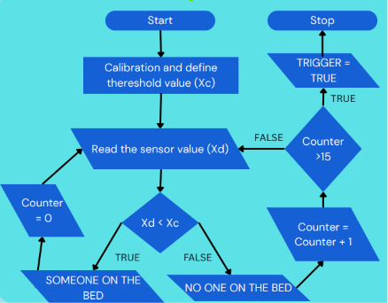
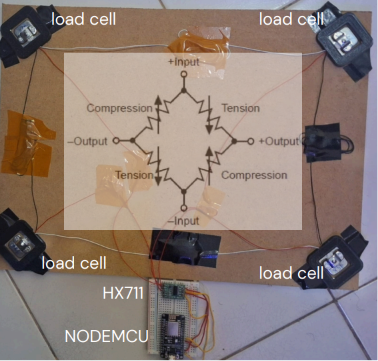

# SERENA: Smart Bed for Dementia Patients

<p align="center">
  
  
  
  
  
</p>

## 🏆 Achievement
* **Bronze Medal** at Indonesia Inventors Day (IID) 2024.
* **Lead Hardware Engineer & Coder:** Muhammad Fadhael Izzil Haq.

## 📝 Overview
This repository contains the source code and documentation for **SERENA (Smart Bed for Dementia Patients)**, an innovative, **low-cost (~Rp200,000)** IoT-based smart bed system designed to address safety risks such as night wandering and fall hazards in elderly patients with dementia, while significantly reducing caregiver burnout.

> 📢 **Portfolio Note:** This project was developed in June 2024 as part of the Indonesia Inventors Day competition. I'm publishing it here for my college application portfolio documentation.

Countries with aging populations face severe healthcare challenges regarding dementia. Night wandering causes extreme safety hazards for patients and deprives caregivers of essential sleep. SERENA solves this by integrating high-precision weight sensors into a patient's bed frame to track their presence wirelessly and instantly dispatch emergency notifications to the caregiver's smartphone when the patient leaves the bed at night.

### Key Features
* **Patient Presence Monitoring:** Employs calibrated strain-gauge load cells underneath the bed posts to accurately track whether the patient is safely in bed.
* **Smart Wandering Detection:** Initiates an automated tracking loop when the patient leaves the bed. If the patient remains out of bed for more than a specified period (e.g., 15 minutes), a trigger is automatically activated.
* **Wireless Remote Alerts:** Powered by NodeMCU (ESP8266) to route critical alerts straight to the caregiver's phone via IFTTT webhooks over Wi-Fi.
* **Low Cost & High Adaptability:** Built as an affordable prototype (~Rp200,000) that can be calibrated and customized to fit any existing bed or mattress setup in homes or elderly care centers.

---

## 🛠️ System Architecture & Logic

The system systematically runs continuous diagnostic loops to monitor the patient's status based on calibrated weight thresholds:

| Scenario | Load Cell Weight Status | System Status | Action / Output |
| :--- | :---: | :---: | :--- |
| **1. Patient In Bed** | ✅ Above Threshold | **SAFE** | System loops every 60 seconds to maintain monitoring. |
| **2. Patient Leaves Bed** | ❌ Below Threshold | **⚠️ TRACKING** | System detects the exit and starts an automated counter. |
| **3. Night Wandering** | ❌ Below Threshold | ⏳ **TIMEOUT (15m)**| Triggers a web request via Wi-Fi to send a push notification. |

---

### System Flowchart



---

## 🔌 Hardware Components

* **Microcontroller:** NodeMCU ESP8266 (Built-in Wi-Fi module)
* **Sensors & Interface:**
  * 4x Load Cells (Strain gauge sensors placed under each bed post)
  * HX711 Amplifier Module (For high-precision weight digitization and calibration)
* **Power Supply:** 5V DC via Micro-USB



---

### Video Demo

https://github.com/user-attachments/assets/33fc01e3-d849-4a3a-9206-f58e1fb68345

---

## 🚀 Getting Started

### Prerequisites
1. Install **Arduino IDE**.
2. Add ESP8266 Board Manager URL in Arduino IDE preferences.
3. Install the **HX711** library along with standard Wi-Fi and HTTP client libraries.
4. Set up an account on **IFTTT** and create a Webhook applet to receive push notifications on your phone.

### Installation & Deployment
1. Clone this repository:
   ```bash
   git clone [https://github.com/fadhaelizzil/serena-smart-bed-dementia.git](https://github.com/fadhaelizzil/serena-smart-bed-dementia.git)
2. Open the .ino file in the /src directory using Arduino IDE.
3. Replace the placeholder credentials with your actual Wi-Fi SSID, Password, and IFTTT Webhook Key:
   * const char* ssid = "YOUR_WIFI_SSID";
   * const char* password = "YOUR_WIFI_PASSWORD";
   * const char* ifttt_key = "YOUR_IFTTT_WEBHOOK_KEY";
4. Calibrate the load cells using a known weight factor and flash the code onto your NodeMCU microcontroller.
5. Place the weight sensor assembly securely under the bed frame posts as documented in the /hardware directory.
